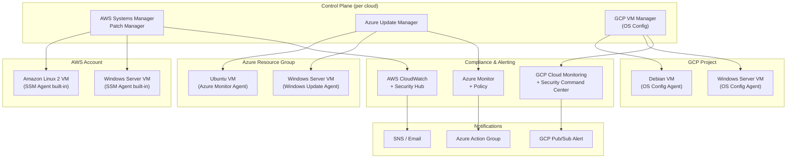
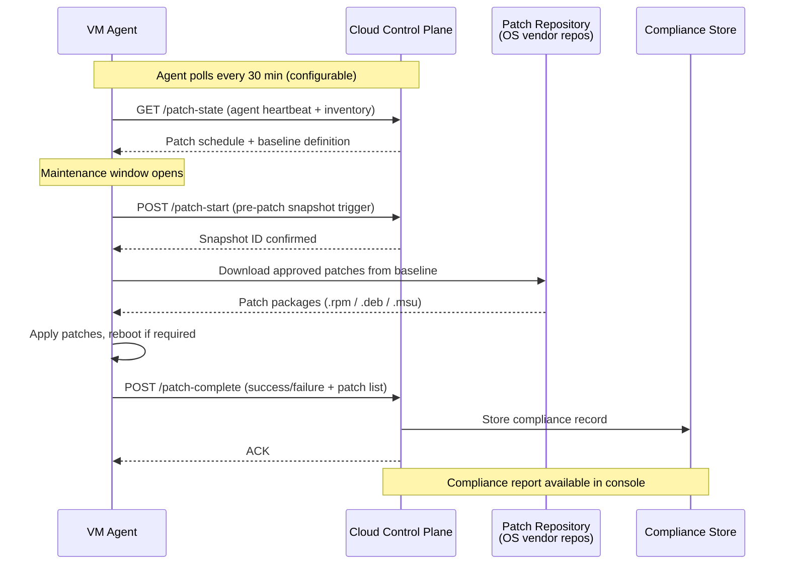
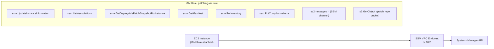
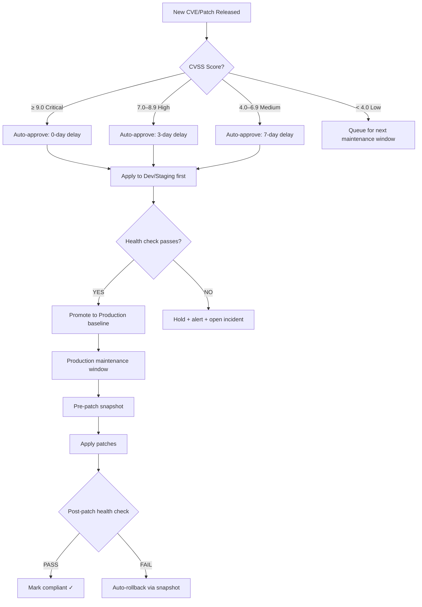
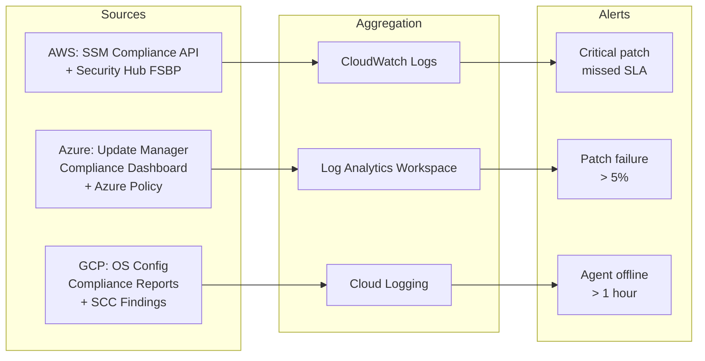

# Automated Multi-Cloud VM Patching System

Enterprise-grade automated patching for Windows and Linux VMs across **AWS**, **Azure**, and **GCP** — following industry patterns used by Netflix, Adobe, and Capital One.

---

## Table of Contents

1. [The Industry Standard Approach to Patching](#1-the-industry-standard-approach-to-patching)
2. [Why Top Tech Companies Use a Hybrid Approach](#2-why-top-tech-companies-use-a-hybrid-approach)
3. [Architecture Overview](#3-architecture-overview)
4. [Agent Communication Flow](#4-agent-communication-flow)
5. [IAM Roles & Permissions](#5-iam-roles--permissions)
6. [Patch Baseline & Approval Workflow](#6-patch-baseline--approval-workflow)
7. [Scheduling & Maintenance Windows](#7-scheduling--maintenance-windows)
8. [Compliance Reporting & Alerting](#8-compliance-reporting--alerting)
9. [Cloud Patch Manager Comparison](#9-cloud-patch-manager-comparison)
10. [When to Patch vs When to Use Immutable Images](#10-when-to-patch-vs-when-to-use-immutable-images)
11. [Security Considerations](#11-security-considerations)
12. [Viewing Resources in Cloud Consoles](#12-viewing-resources-in-cloud-consoles)
13. [Project Structure](#13-project-structure)
14. [Quick Start](#14-quick-start)

---

## 1. The Industry Standard Approach to Patching

### The Problem Patching Solves

Every running VM accumulates **patch debt** — the gap between installed package versions and the latest security-hardened releases. Left unmanaged, this debt becomes:

- **CVE exposure** — unpatched kernel vulnerabilities, OpenSSL bugs, RDP/SSH daemon exploits
- **Compliance failures** — PCI-DSS, SOC 2, HIPAA, FedRAMP all mandate patch SLAs
- **Audit findings** — "critical patches >30 days old" is a common red flag

### The Industry-Standard Patch SLA Model

| Severity | Discovery-to-Patch SLA | Industry Standard |
|----------|------------------------|-------------------|
| Critical (CVSS ≥ 9.0) | 24–72 hours | NIST SP 800-40r3 |
| High (CVSS 7.0–8.9) | 7–14 days | CIS Controls v8 |
| Medium (CVSS 4.0–6.9) | 30 days | SOC 2 / PCI-DSS |
| Low (CVSS < 4.0) | 90 days or next maintenance window | Internal policy |

### The Five Phases of a Mature Patching Program

```
┌─────────────┐    ┌─────────────┐    ┌─────────────┐    ┌─────────────┐    ┌─────────────┐
│  1. SCAN    │───▶│  2. ASSESS  │───▶│  3. APPROVE │───▶│  4. DEPLOY  │───▶│  5. VERIFY  │
│             │    │             │    │             │    │             │    │             │
│ Inventory   │    │ CVSS Score  │    │ Baseline    │    │ Maintenance │    │ Compliance  │
│ all VMs     │    │ Risk rank   │    │ approval    │    │ window      │    │ report      │
│ Detect      │    │ Test env    │    │ Change mgmt │    │ Pre/post    │    │ Alert on    │
│ missing     │    │ validation  │    │ sign-off    │    │ snapshots   │    │ failures    │
│ patches     │    │             │    │             │    │             │    │             │
└─────────────┘    └─────────────┘    └─────────────┘    └─────────────┘    └─────────────┘
```

---

## 2. Why Top Tech Companies Use a Hybrid Approach

### The Core Tension: Immutable vs Mutable Infrastructure

**Immutable (golden image) approach:** Never patch running VMs. Instead, build a new AMI/image with patches baked in, roll it out via blue/green deployment, terminate old instances.

**Mutable (in-place patching) approach:** Keep VMs running, apply patches via an agent, restart services as needed.

### Why You Need Both (The Hybrid Reality)

Netflix, Adobe, and Capital One all operate hybrid fleets:

```
                    IMMUTABLE                              MUTABLE
                 (Golden Images)                      (In-Place Patching)
    ┌──────────────────────────────┐    ┌──────────────────────────────────────┐
    │  Stateless workloads         │    │  Stateful workloads                  │
    │  • Auto-scaling web servers  │    │  • Databases (RDS-like self-managed)  │
    │  • Lambda / container tasks  │    │  • Windows AD domain controllers      │
    │  • Microservices             │    │  • Legacy monoliths                   │
    │                              │    │  • Build agents (ephemeral but fat)   │
    │  HOW:                        │    │  • VMs with persistent local state    │
    │  Packer + CI builds new AMI  │    │                                       │
    │  → Deploy new ASG launch     │    │  HOW:                                 │
    │    template → rolling update │    │  SSM / Azure Update Manager / GCP     │
    │  → Drain & terminate old     │    │  OS Config → scheduled maintenance    │
    │    instances                 │    │  window → pre-snapshot → patch →      │
    └──────────────────────────────┘    │  verify → post-health-check           │
                                        └──────────────────────────────────────┘
```

### Real-World Examples

| Company | Stateless Workloads | Stateful/Legacy |
|---------|--------------------|-----------------| 
| **Netflix** | Immutable AMIs via Spinnaker. Instances recycled weekly regardless of patch status. | Cassandra clusters and build servers patched in-place via internal "Janitor Monkey" tooling. |
| **Adobe** | Container workloads rebuilt on base image updates. | Thousands of legacy Windows VMs for Creative Cloud licensing servers — patched via WSUS + custom orchestration. |
| **Capital One** | AWS-native Lambda + ECS — images rebuilt in CI. | Database tier and on-prem-migrated Windows VMs — patched via AWS Systems Manager with strict maintenance windows and pre-patch snapshots. |

---

## 3. Architecture Overview



---

## 4. Agent Communication Flow

All three clouds use an **agent-pull model** — the VM agent polls the control plane over HTTPS (port 443 outbound only). No inbound firewall rules are needed.



### Why Agent-Pull (Not Push)?

| Concern | Agent-Pull (industry standard) | SSH/WinRM Push |
|---------|-------------------------------|----------------|
| Firewall rules | Outbound 443 only | Inbound SSH/5985 open |
| Scalability | Millions of agents supported | Requires connectivity management |
| Security | Agents authenticate with instance identity | Credential management burden |
| Reliability | Agent retries on its own schedule | Orchestrator must track failures |

---

## 5. IAM Roles & Permissions

### AWS — Minimum SSM Permissions



**Managed policy shortcut:** `arn:aws:iam::aws:policy/AmazonSSMManagedInstanceCore`
(Never use `AdministratorAccess` — this violates least-privilege.)

### Azure — Minimum Update Manager Permissions

```
Subscription scope:
├── Reader                          (read VM inventory)
└── Resource Group scope:
    ├── Virtual Machine Contributor  (restart VMs for patching)
    └── Log Analytics Contributor    (write compliance logs)

Custom role for service principal:
  Actions:
    - Microsoft.Compute/virtualMachines/read
    - Microsoft.Compute/virtualMachines/write       (needed for extensions)
    - Microsoft.Compute/virtualMachines/restart/action
    - Microsoft.Maintenance/maintenanceConfigurations/*
    - Microsoft.Maintenance/applyUpdates/*
    - Microsoft.Maintenance/configurationAssignments/*
```

### GCP — Minimum OS Config Permissions

```
VM Service Account roles:
  roles/osconfig.patchJobExecutor    (run patch jobs)
  roles/logging.logWriter            (write patch logs)
  roles/monitoring.metricWriter      (compliance metrics)

Project-level IAM for operators:
  roles/osconfig.patchJobViewer      (read-only audit)
  roles/osconfig.patchDeploymentAdmin (manage schedules)
```

---

## 6. Patch Baseline & Approval Workflow

A **patch baseline** defines which patches are auto-approved vs require manual review.

```
┌─────────────────────────────────────────────────────────────────┐
│                    PATCH BASELINE DEFINITION                    │
├─────────────────────────────────────────────────────────────────┤
│  Classification  │  Auto-Approve  │  Delay   │  Exclude         │
├──────────────────┼────────────────┼──────────┼──────────────────┤
│  Security        │  YES           │  3 days  │  Kernel on prod  │
│  Critical        │  YES           │  0 days  │  (never exclude) │
│  Bugfix          │  YES           │  7 days  │                  │
│  Enhancement     │  NO            │  Manual  │                  │
│  Recommended     │  NO            │  Manual  │                  │
│  Kernel updates  │  Staging only  │  14 days │  Prod: manual    │
└──────────────────┴────────────────┴──────────┴──────────────────┘
```

### Approval Workflow



---

## 7. Scheduling & Maintenance Windows

### Design Principles

- **Stagger windows** across cloud providers to avoid simultaneous reboots
- **Never overlap** database tier with app tier maintenance
- **Pre-patch snapshots** mandatory for production
- **Canary patching** — patch 5% of fleet first, check health, then proceed

```
MAINTENANCE WINDOW SCHEDULE (UTC)
═══════════════════════════════════════════════════════════════
  Mon  Tue  Wed  Thu  Fri  Sat  Sun
                                [02:00-04:00] AWS Linux Dev
                                [04:00-06:00] AWS Windows Dev
                      [02:00-04:00] Azure Linux Dev
                      [04:00-06:00] Azure Windows Dev
                [02:00-04:00] GCP Linux Dev
                [04:00-06:00] GCP Windows Dev
───────────────────────────────────────────────────────────────
Prod Linux:   Saturday 02:00–06:00 UTC  (all clouds, staggered)
Prod Windows: Sunday   02:00–06:00 UTC  (all clouds, staggered)
═══════════════════════════════════════════════════════════════
```

### Per-Cloud Scheduling

| Cloud | Service | Scheduling Unit | Min Window |
|-------|---------|----------------|------------|
| AWS | SSM Maintenance Window | Cron expression | 1 hour |
| Azure | Maintenance Configuration | Schedule (daily/weekly/monthly) | 1 hour 30 min |
| GCP | OS Patch Deployment | Cron expression | N/A (runs to completion) |

---

## 8. Compliance Reporting & Alerting



### Key Compliance Metrics to Track

| Metric | Target | Alert Threshold |
|--------|--------|-----------------|
| % VMs patched within SLA | ≥ 99% | < 95% |
| Critical patches pending > 72h | 0 | Any |
| Agent connectivity (heartbeat) | 100% | Any VM offline > 1h |
| Patch job failure rate | < 1% | > 5% |
| Mean time to patch (MTTP) | < 7 days avg | > 14 days |

---

## 9. Cloud Patch Manager Comparison

| Feature | AWS Systems Manager Patch Manager | Azure Update Manager | GCP VM Manager (OS Config) |
|---------|----------------------------------|---------------------|---------------------------|
| **Supported OS** | Amazon Linux, RHEL, Ubuntu, SLES, Windows | Ubuntu, RHEL, SLES, Windows | Debian, Ubuntu, RHEL, SLES, CentOS, Windows |
| **Agent required** | SSM Agent (pre-installed on official AMIs) | Azure Monitor Agent or legacy MMA | OS Config Agent (pre-installed on official GCE images) |
| **Patch baselines** | Full control (classification, severity, include/exclude lists) | Automatic + custom schedules | Automatic + custom patch configs |
| **Maintenance windows** | Full cron scheduling via SSM Maintenance Windows | Maintenance Configurations (integrated with Azure Update Manager) | Patch deployments with cron |
| **Pre-patch snapshots** | Manual (EventBridge → Lambda → CreateSnapshot) or AWS Backup | Azure Backup integration | Native snapshot before patching |
| **Compliance reports** | SSM Compliance API + Security Hub | Update Manager dashboard + Azure Policy | OS Config reports + SCC |
| **Multi-account support** | AWS Organizations integration | Azure Policy at management group | GCP Organization constraints |
| **Cost** | SSM free for EC2; $0.00 per managed instance (EC2) | Free for Azure VMs | Free for GCE VMs |
| **Non-cloud VMs** | SSM Hybrid Activations (on-prem) | Azure Arc | Not natively supported |
| **Kernel live patch** | No native; use kpatch + SSM | Live patching via Livepatch (Ubuntu) | No native |
| **Windows WSUS integration** | Reads Windows Update directly | Reads Windows Update directly | Reads Windows Update directly |

### When Each Excels

**Use AWS SSM Patch Manager when:**
- Your entire infrastructure is AWS-native
- You need tight integration with AWS Organizations and SCPs
- You want SSM Run Command for pre/post patch scripts

**Use Azure Update Manager when:**
- You're running Windows Server workloads (best Windows support)
- You need Azure Arc to manage on-prem or other-cloud VMs from one pane
- You want native integration with Azure Policy for compliance

**Use GCP VM Manager when:**
- Your fleet is Google Compute Engine
- You want zero-config patching (OS Config agent is pre-installed)
- You need integration with GCP Security Command Center

---

## 10. When to Patch vs When to Use Immutable Images

```
Decision Framework
                    ┌─────────────────────────────────┐
                    │ Does the workload have           │
                    │ persistent LOCAL state?          │
                    └──────────────┬──────────────────┘
                                   │
               ┌───────────────────┴───────────────────┐
               │ NO                                     │ YES
               ▼                                        ▼
   ┌───────────────────────┐             ┌──────────────────────────┐
   │ Can it be restarted   │             │ PATCH IN-PLACE           │
   │ in < 5 minutes?       │             │                          │
   └──────────┬────────────┘             │ Examples:                │
              │                          │ • Databases              │
        ┌─────┴─────┐                    │ • Domain controllers     │
        │ YES       │ NO                 │ • Legacy monoliths       │
        ▼           ▼                    │ • Build servers          │
   IMMUTABLE    CONSIDER                 │   with large caches      │
   IMAGES       IMMUTABLE               └──────────────────────────┘
                WITH LONGER
                DRAIN TIME
   Examples:
   • Auto-scaling web tiers
   • Containers / Lambda
   • Stateless microservices
```

**Rule of thumb:** If spinning up a replacement from a new image and redirecting traffic takes < 10 minutes with zero data loss, use immutable. Otherwise, patch in-place with pre-patch snapshots as your rollback plan.

---

## 11. Security Considerations

### Agent Hardening

```
✅ DO                                          ❌ DON'T
─────────────────────────────────────────────────────────
Use instance identity for auth (IMDSv2)       Store credentials on disk
Restrict agent to HTTPS 443 outbound only     Open inbound SSH/WinRM for patching
Use VPC endpoints (no internet for SSM)       Route patch traffic over public internet
Verify patch package signatures               Skip GPG/Authenticode verification
Run agent as least-privilege service account  Run agent as root/SYSTEM permanently
Log all patch operations to SIEM              Leave audit trail disabled
```

### Network Isolation for Patching

```
VPC / VNet / VPC (GCP)
├── Private Subnet (VMs live here)
│   └── VMs: outbound 443 → VPC endpoint only
│
├── VPC Endpoints / Private Link / PSC
│   ├── SSM endpoint (AWS)
│   ├── Azure Update Manager (via Private Link)
│   └── GCP OS Config (via PSC)
│
└── NO inbound rules required for patching
    NO direct internet access required (if using private endpoints)
```

### Least-Privilege IAM Checklist

- [ ] VM agent role has **only** patch/inventory permissions — no EC2 describe, no S3 list
- [ ] Human operators use separate roles (viewer vs executor vs admin)
- [ ] Service accounts for automation are **subscription/account-scoped**, not tenant-wide
- [ ] All IAM changes go through IaC (no manual console IAM edits)
- [ ] MFA required for any human role that can approve patches

---

## 12. Viewing Resources in Cloud Consoles

### AWS
- **Patch Manager:** AWS Console → Systems Manager → Patch Manager
- **Compliance:** Systems Manager → Compliance
- **Maintenance Windows:** Systems Manager → Maintenance Windows
- **Inventory:** Systems Manager → Inventory
- **Security Hub:** Security Hub → Findings (filter: `ProductName = "Systems Manager"`)

### Azure
- **Update Manager:** Azure Portal → Update Manager (search "Update Manager")
- **Patch compliance:** Update Manager → Overview → Compliance by resource group
- **Maintenance Configurations:** Update Manager → Maintenance Configurations
- **Policy compliance:** Azure Policy → Compliance

### GCP
- **VM Manager:** GCP Console → Compute Engine → VM Manager (left sidebar)
- **Patch jobs:** VM Manager → Patch Jobs
- **Patch deployments (schedules):** VM Manager → Patch Deployments
- **OS inventory:** VM Manager → OS Inventory
- **SCC findings:** Security Command Center → Findings (filter: `source_id = "vm-manager"`)

---

## 13. Project Structure

```
patching-system/
├── README.md                          # This file
├── docs/
│   └── architecture.md               # Extended architecture notes
│
├── scripts/
│   ├── create-vms.sh                  # Provision test VMs (all 3 clouds)
│   ├── destroy-vms.sh                 # Tear down all test VMs
│   └── azure-service-account.sh      # Create scoped Azure SP for automation
│
├── iam/
│   ├── aws-ssm-policy.json            # Least-privilege SSM policy
│   ├── azure-patching-role.json       # Custom Azure RBAC role definition
│   └── gcp-patch-sa.yaml             # GCP service account + bindings
│
├── patching/
│   ├── aws/
│   │   ├── patch-baseline.json        # SSM patch baseline definition
│   │   └── maintenance-window.json    # SSM maintenance window config
│   ├── azure/
│   │   └── maintenance-config.json    # Azure maintenance configuration
│   └── gcp/
│       └── patch-deployment.yaml      # GCP OS Config patch deployment
│
├── modules/                           # Reusable Terraform modules
│   ├── aws-patching/                  # AWS SSM + IAM + S3 + EventBridge + SNS
│   │   ├── versions.tf
│   │   ├── variables.tf
│   │   ├── main.tf
│   │   └── outputs.tf
│   ├── azure-patching/               # Azure identity + Log Analytics + maintenance + policy
│   │   ├── versions.tf
│   │   ├── variables.tf
│   │   ├── main.tf
│   │   └── outputs.tf
│   └── gcp-patching/                 # GCP SA + OS Config + Pub/Sub + Scheduler + Logging
│       ├── versions.tf
│       ├── variables.tf
│       ├── main.tf
│       └── outputs.tf
│
└── terraform/                         # Root modules (call modules above, run terraform here)
    ├── aws/
    │   ├── versions.tf                # Provider pins + backend (local)
    │   ├── provider.tf
    │   ├── main.tf                    # module "patching" { source = "../../modules/aws-patching" }
    │   ├── variables.tf
    │   ├── outputs.tf
    │   └── terraform.tfvars.example   # Copy → terraform.tfvars before applying
    ├── azure/
    │   ├── versions.tf
    │   ├── provider.tf
    │   ├── main.tf
    │   ├── variables.tf
    │   ├── outputs.tf
    │   └── terraform.tfvars.example
    └── gcp/
        ├── versions.tf
        ├── provider.tf
        ├── main.tf
        ├── variables.tf
        ├── outputs.tf
        └── terraform.tfvars.example
```

---
## 14. Testing Strategy (Production Mindset)

### Pre-Patch Validation
- Patch staging environment first (dev → qa → prod)
- Run integration tests against patched VMs before production
- Validate application health endpoints post-patch

### Rollback Plan
- AWS: DLM snapshot before patching; restore from snapshot
- Azure: Azure Backup integration; restore VM
- GCP: Pre-patch disk snapshot; detach/replace disk

### Canary Deployment
1. Patch 5% of fleet
2. Monitor error rate, latency, CPU for 30 minutes
3. If anomaly detected: stop, rollback, alert
4. If healthy: patch remaining 95%

---
## 15. Quick Start

### Phase 1 — Create Test VMs
```bash
# Set required environment variables
export AWS_PROFILE=your-profile        # or use OIDC token
export AZURE_SUBSCRIPTION_ID=2f791c46-1726-4a0c-94e8-48314ac8f1b4
export GCP_PROJECT=learn-image-project

# Create test VMs (cheapest SKUs, 24h TTL tag)
./scripts/create-vms.sh

# Verify VMs are running
./scripts/create-vms.sh --status
```

### Phase 2 — Verify Patch Agents
```bash
# Check SSM agent registration (AWS)
aws ssm describe-instance-information --filters "Key=tag:Project,Values=patching-system"

# Check Azure Update Manager registration
az maintenance applyupdate list --resource-group patching-system-rg

# Check GCP OS Config agent
gcloud compute instances os-inventory list-instances --project=$GCP_PROJECT
```

### Phase 3 — Deploy Terraform Infrastructure

Each cloud is a separate root module. Requires cloud credentials configured before running.

```bash
# AWS
cd terraform/aws
cp terraform.tfvars.example terraform.tfvars   # fill in region, alert_email, etc.
terraform init
terraform plan
terraform apply

# Azure
cd terraform/azure
cp terraform.tfvars.example terraform.tfvars   # fill in subscription_id, resource_group_name, location
terraform init
terraform plan
terraform apply

# GCP
cd terraform/gcp
cp terraform.tfvars.example terraform.tfvars   # fill in project_id, region
terraform init
terraform plan
terraform apply
```

Key outputs after apply:
- **AWS:** `instance_profile_name` (attach to EC2 launch templates), `maintenance_window_id`, `sns_topic_arn`
- **Azure:** `user_assigned_identity_client_id` (reference in VM identity blocks), `maintenance_config_linux_id`, `log_analytics_workspace_id`
- **GCP:** `service_account_email` (assign to GCE VMs), `patch_deployment_linux_id`, `log_sink_bucket_name`

To opt a VM into automated patching:
- **AWS:** tag the instance with `ssm-patching = true`
- **Azure:** create a `azurerm_maintenance_assignment` pointing to `maintenance_config_linux_id` or `maintenance_config_windows_id`
- **GCP:** label the instance with `os-patch = enabled`

### Phase 4 — Run a Patch Scan (no changes)
```bash
# AWS: run compliance scan only
aws ssm start-associations-once --association-ids <patch-scan-association-id>

# Azure: assess updates without installing
az maintenance applyupdate create --resource-group patching-system-rg \
  --provider-name Microsoft.Compute --resource-type VirtualMachines \
  --resource-name <vm-name> --apply-update-name default

# GCP: execute dry-run patch job
gcloud compute os-config patch-jobs execute --project=$GCP_PROJECT \
  --dry-run --instance-filter-all
```

### Phase 5 — Destroy All Test VMs
```bash
./scripts/destroy-vms.sh
```

---

*This system follows [NIST SP 800-40r3](https://csrc.nist.gov/publications/detail/sp/800-40/rev-3/final) "Guide to Enterprise Patch Management Planning" and [CIS Controls v8](https://www.cisecurity.org/controls/v8) Control 7 (Continuous Vulnerability Management).*
